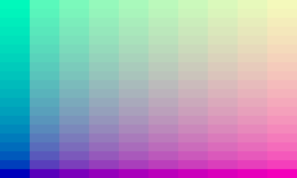

# lilgpu
Lil wrapper to toy with WebGPU
```ts
import { d, Lil, uniform } from "https://esm.sh/gh/gnlow/lilgpu/browser.ts"

class MyProgram extends Lil {
    vertShader = `... GLSL code ...`
    fragShader = `... GLSL code ...`

    @uniform(d.struct({
        x: d.u32,
        y: d.u32,
    }))
    accessor span = { x: 10, y: 20 }

    @uniform(d.f32)
    accessor blue = 0.5
}
const app = new MyProgram()
const g = await app.init(document.querySelector("canvas")!)
g.draw(4 /* The number of vertices */)

const tick = () => new Promise(requestAnimationFrame)

while (true) {
    await tick()
    basic.blue = Math.sin(Date.now()/1000)/2+0.5
    g.draw(4)
}
```
- Tested on Chromium and Deno (+ Jupyter)
- Not production-ready
- Currently type checking is limited due to TypeScript not supporting decorator mutation ([microsoft/TypeScript#4881](https://github.com/microsoft/TypeScript/issues/4881))

## Usage
See [more examples](./example).  
Below is from [./example/browser/Basic.ts](./example/browser/Basic.ts).  
Run [this](https://esm.sh/gh/gnlow/lilgpu@bd48c76/example/browser/Basic.html) on your browser.

### Import

#### Browser
```js
import { d, Lil, uniform } from "https://esm.sh/gh/gnlow/lilgpu/browser.ts"
```

#### Deno
```js
import { d, Lil, uniform } from "https://denopkg.com/gnlow/lilgpu/deno.ts"
```

### Define

#### Shader
```js
const vertShader = ` ... `
const fragShader = ` ... `
```

<details>
<summary>Actual Shader code</summary>

```js
const vertShader = `
struct Output {
    @builtin(position) pos: vec4f,
    @location(0) uv: vec2f,
}

@vertex
fn main(
    @builtin(vertex_index) vertexIndex: u32,
) -> Output {
    var pos = array<vec2f, 4>(
        vec2(1, 1), // top-right
        vec2(-1, 1), // top-left
        vec2(1, -1), // bottom-right
        vec2(-1, -1) // bottom-left
    );
    var uv = array<vec2f, 4>(
        vec2(1., 1.), // top-right
        vec2(0., 1.), // top-left
        vec2(1., 0.), // bottom-right
        vec2(0., 0.) // bottom-left
    );
    var out: Output;
    out.pos = vec4f(pos[vertexIndex], 0.0, 1.0);
    out.uv = uv[vertexIndex];
    return out;
}
`
const fragShader = `
@fragment
fn main(
    @location(0) uv: vec2f,
) -> @location(0) vec4f {
    let red = floor(uv.x * f32(span.x)) / f32(span.x);
    let green = floor(uv.y * f32(span.y)) / f32(span.y);
    return vec4(red, green, blue, 1.0);
}
`
```

</details>

#### Uniform Buffer
```ts
class Basic extends Lil {
    vertShader = vertShader
    fragShader = fragShader

    @uniform(d.struct({
        x: d.u32,
        y: d.u32,
    }))
    accessor span = { x: 10, y: 20 }

    @uniform(d.f32)
    accessor blue = 0.5
}
```

### Draw

#### Browser
```ts
const basic = new Basic()
const g = await basic.init(document.querySelector("canvas")!)

g.draw(4)
```

##### Browser - Animate
```ts
const tick = () => new Promise(requestAnimationFrame)

while (true) {
    await tick()
    basic.blue = Math.sin(Date.now()/1000)/2+0.5
    g.draw(4)
}
```


#### Deno
```ts
const basic = new Basic()
const g = await basic.init(500, 300)

g.draw(4)

const image = await g.getImage() // Uint8Array
await Deno.writeFile("./Basic.png", image)
```

##### Deno - Jupyter
```ts
image
```

